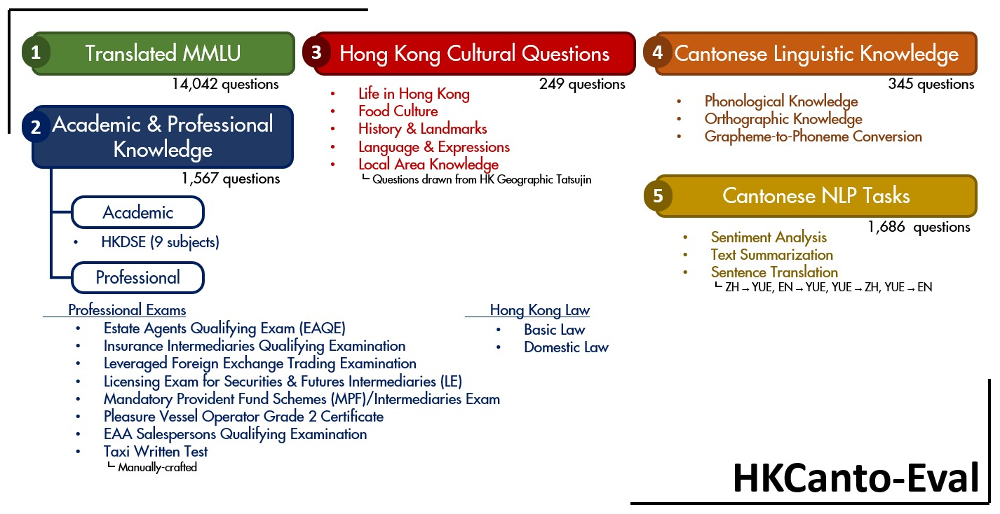

# HKCanto-Eval: A Benchmark for Evaluating Cantonese Language Understanding and Cultural Comprehension in LLMs



The ability of language models to comprehend and interact in diverse linguistic and cultural landscapes is crucial. The Cantonese language used in Hong Kong presents unique challenges for natural language processing due to its rich cultural nuances and lack of dedicated evaluation datasets. The HKCanto-Eval benchmark addresses this gap by evaluating the performance of large language models (LLMs) on Cantonese language understanding tasks, extending to English and Written Chinese for cross-lingual evaluation. HKCanto-Eval integrates cultural and linguistic nuances intrinsic to Hong Kong, providing a robust framework for assessing language models in realistic scenarios. Additionally, the benchmark includes questions designed to tap into the underlying linguistic metaknowledge of the models. Our findings indicate that while proprietary models generally outperform open-weight models, significant limitations remain in handling Cantonese-specific linguistic and cultural knowledge, highlighting the need for more targeted training data and evaluation methods.

## Usage


### Multiple Choice Questions

Available benchmarks:
- canto-mmlu: Translated from the MMLU benchmark to Cantonese with Gemini Flash 1.5
- mmlu: Original MMLU benchmark in English
- cultural: Hong Kong Cultural Questions
- dse: Hong Kong DSE Questions
- hk-law: Hong Kong Law Questions
- phonetics: Linguistic Knowledge (phonological and orthographic knowledege)
- professional: Professional knowledge exams
```
python scripts/eval.py \
    --model hon9kon9ize/CantoneseLLMChat-v0.5 # model name
    --benchmark canto-mmlu # benchmark name 
    --ntrain 5 # optional, default 5 
    --dtype bfloat16 # optional, default bfloat16 
```

### NLP Tasks

Available tasks:
- summarization
- fewshot_eng_yue_translation
- fewshot_yue_eng_translation
- fewshot_yue_zh_translation
- fewshot_zh_yue_translation
- eng_yue_translation
- yue_eng_translation
- yue_zh_translation
- zh_yue_translation
- sentiment

```
python scripts/nlp.py \
    --model hon9kon9ize/CantoneseLLMChat-v0.5 # model name 
    --task summarization # task name 
```

### Grapheme-to-Phoneme Conversion (G2P)

```
python scripts/g2p.py \
    --model hon9kon9ize/CantoneseLLMChat-v0.5 # model name 
    --task zh_to_jyutping # Only 1 task available 
```


### Using Proprietary Models

Supported proprietary models via API:
- Anthropic Claude Sonnet (with support via AWS)
- Baidu Ernie 
- OpenAI API (with support via Azure)
- Google Gemini
- xFyun 

Example 1 
Claude via AWS (most models follow the same format):
```
python scripts/eval.py --task cultural --ntrain 5 \
      --model=anthropic.claude-3-5-sonnet-20240620-v1:0 \
      --api_key <API_KEY> 
```

Example 2 
Third party (Siliconflow) using OpenAI API format:
```
python scripts/g2p.py --task zh_to_jyutping \
     --api_key <API_KEY> \
     --model=siliconflow/meta-llama/Meta-Llama-3.1-405B-Instruct \
     --model_url=https://api.siliconflow.cn/v1
```
